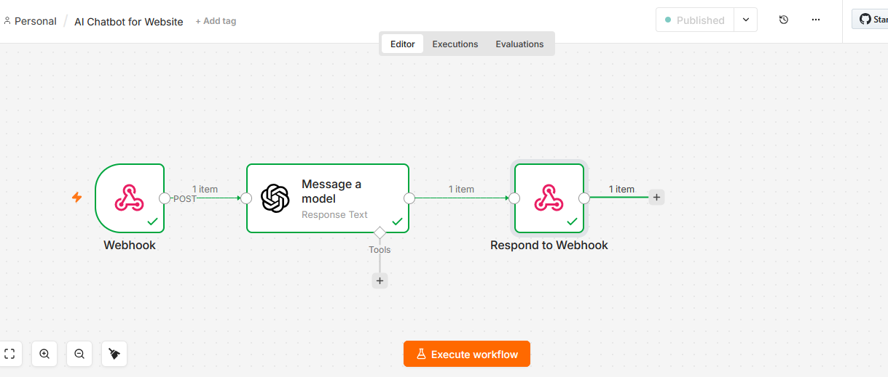

# 🤖 AI Chatbot for Website — n8n + OpenAI Automation

## What This Does

I built this because every business deserves a 24/7 assistant.

Most small business websites have no live chat.
Visitors come. They have questions.
Nobody answers. They leave.

So I built an AI chatbot that never sleeps.

Now when someone visits your website and asks a question,
they get an intelligent answer instantly.
No human needed. No delay. Ever.

---

## The Problem I Solved

I talked to dozens of website owners.

They all said the same thing.

"People visit my website but never contact me."
"I lose customers because nobody answers their questions."
"I cannot afford to hire someone just to answer chats."

This AI chatbot fixes all three problems.

It answers questions instantly.
It works 24 hours a day, 7 days a week.
It costs almost nothing to run.

One setup. Forever working.

---

## How It Works

No coding needed on your end.
Just a clean intelligent system that works every time.

Step 1 — Visitor types a question on your website
"What are your prices?" "Are you open?" "How do I order?"
Anything. The chatbot catches it all.

Step 2 — Question goes to n8n via Webhook
Instantly. No delay.

Step 3 — OpenAI reads the question
The AI understands the question completely.
It thinks about the best answer for your business.

Step 4 — AI sends back a professional answer
Polite. Clear. Instant.
The visitor sees the answer in under 3 seconds.

Step 5 — Visitor gets help immediately
They stay on your site.
They trust your business.
They become a customer.

---

## Live Demo

Try the chatbot here:
[mmostakinhossain313.github.io/ai-chatbot-website/chatbot.html](https://mmostakinhossain313.github.io/ai-chatbot-website/chatbot.html)

---

## Workflow Screenshot


---

## Flow Diagram

```
Visitor Asks Question
        ↓
Webhook Catches Question
        ↓
OpenAI Reads + Answers
        ↓
Answer Sent Back to Visitor
        ↓
Done ✅
```

---

## The Nodes I Used

### Node 1 — Webhook
Sits and waits for questions from your website.
The moment someone types and hits send,
this node catches the question and passes it forward.
Works 24/7. Never misses a message.

### Node 2 — OpenAI (Message a Model)
The brain of the whole system.
Takes the visitor's question.
Thinks about the best answer.
Responds professionally every time.
Model used: GPT-4o-mini — fast, smart, affordable.

### Node 3 — Respond to Webhook
Takes the AI answer and sends it back to the website.
The visitor sees the response in under 3 seconds.
Clean. Instant. Professional.

---

## What I Learned Building This

I want to be honest about the mistakes I made.
Because buyers deserve to know I have solved the hard problems.

Mistake 1 — I used Test URL in the HTML file.
The chatbot stopped working after I closed n8n.
Fix: Always use Production URL in any external app.

Mistake 2 — I used response.json() in the HTML.
Got a syntax error. Chatbot showed nothing.
Fix: Use response.text() because n8n sends plain text.

Mistake 3 — I forgot to connect OpenAI to Respond to Webhook.
Visitor sent a question. Got no reply back.
Fix: Always connect all nodes properly before publishing.

Mistake 4 — I ran the HTML file locally.
Got a CORS error. Chatbot could not reach n8n.
Fix: Host on GitHub Pages. Free and works perfectly.

Every mistake I made, I fixed.
So you never have to face them.

---

## Google Sheet Structure

Not applicable for this workflow.
All responses go directly back to the website visitor.

---

## Who Needs This

- Small business owners losing visitors daily
- E-commerce stores with unanswered product questions
- Coaches and consultants needing 24/7 availability
- Restaurants, clinics, salons — any business with FAQs
- Anyone who cannot afford a full-time live chat agent

---

## Real Questions From Real Buyers

**Can the AI answer questions about my specific business?**
Yes. I customize the AI with your business details.
Products. Prices. Policies. Hours. Anything you want it to know.

**What language can it speak?**
Any language. English, Bengali, Arabic, Spanish — all work.

**Will it give wrong answers?**
I set it up with clear instructions about your business.
If it does not know something, it says please contact us directly.
No random answers. No confusion.

**Can I add this to my existing website?**
Yes. One small addition to your website.
I handle everything else.

**How long does setup take?**
Under 30 minutes for a basic chatbot.
Under 1 hour for a fully customized one.

**Is this a one time setup?**
Yes. Set it up once. It runs forever.

---

## Download & Import Workflow

1. Download the file here: Go Json file
2. Open n8n
3. Click Import Workflow
4. Upload the JSON file
5. Add your OpenAI API key
6. Publish and you are live

---

## What I Built This With

- n8n — workflow automation (free at n8n.io)
- OpenAI API — GPT-4o-mini model
- Webhook — catches questions from website
- HTML + JavaScript — simple chatbot UI
- GitHub Pages — free hosting for the chatbot

---

## 💰 Hire Me — Pricing

I do not just send you a JSON file.
I build a custom AI chatbot for your business.
Trained on your products. Your prices. Your policies.
Tested. Live. Working.

| Package | Price | What You Get |
|---------|-------|-------------|
| **Basic** | $30 | AI chatbot setup + basic business instructions + tested + live |
| **Standard** | $50 | Everything in Basic + custom business training + website integration + 3 days support |
| **Premium** | $80 | Everything in Standard + multilingual support + 2 extra customizations + 7 days support |

---

## Why Work With Me

I show my full work right here on GitHub.
Every node. Every step. Every decision.
I even show the mistakes I made and how I fixed them.
You can try the live demo before spending a single dollar.

No surprises. No hidden steps. No confusion.
Just a working AI chatbot delivered professionally.

---

## Ready To Get Started?

Message me on Fiverr or Upwork.
Tell me about your business.
I will build you a chatbot that knows your business inside out.

Response time: under 2 hours.

I look forward to working with you.
